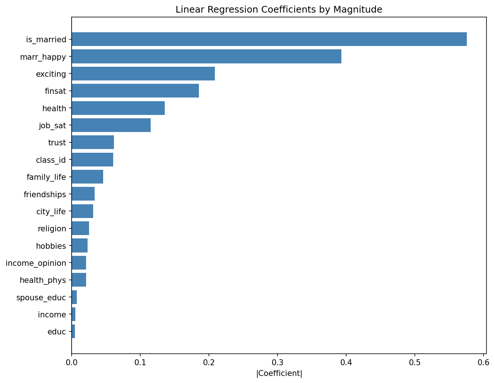
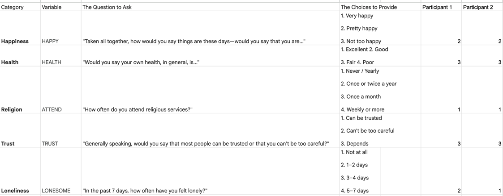
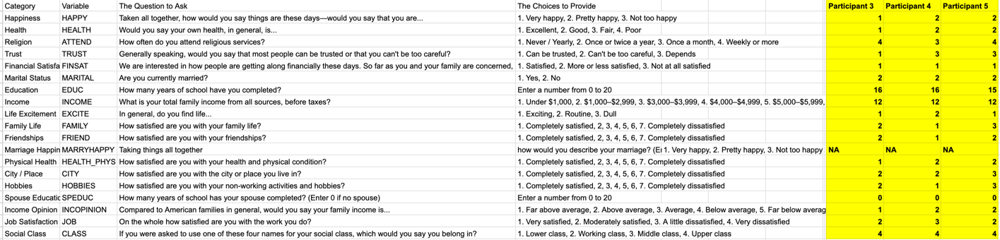
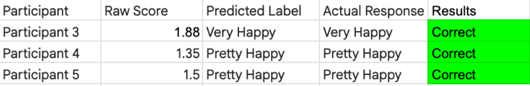

# Happiness Predictor Trained on GSS
By: Zhihe Tian 
## How to Build and Run the Code
### 1. Download the Data
The GSS dataset is too large to store in this repository (1.9GB). So please download it using the link below! 
1. https://www.kaggle.com/datasets/norc/general-social-survey?resource=download
2. Download the CSV and move the file to: `GSS_Data_CSV_CodeBook/gss.csv`

### 2. Install Dependencies
I have followed the standard procedures, so it should be fairly easy to test the code using the command lines below.
```bash
make install
```

### 3. Run the Model
```bash
make run
```

### 4. Run Tests
```bash
make test
```
## Introduction 
Note: Detailed introduction and proposal at proposal.md

TLDR: My goal is to predict how happy and content a person feels toward their life based on their lifestyle choices, health, socioeconomic situation, gender, attachment style, job, and many other factors. In other words, I need to identify and rank the biggest predictors of happiness through a linear regression model on large survey data. 
## Methods
### Data collection and process
The source I chose to train and validate my data on is the General Social Survey (GSS) by the University of Chicago.
Shown in code the GSS has surveyed thousands of Americans since 1972 about their happiness, marital status, income, religious practice, job satisfaction, etc.

This study has been running for 50 years, interviewing over 60,000 applicants, and covers hundreds of areas (see GSS_Codebook_index.pdf for details) that affects a person's happiness. I downloaded this data as a csv file from Kaggle. 

I will also be asking people around me at BU similar questions to the online surveys. This will give me a set of data to validate my linear regression model with, on top of reserving 20% of my online data as my validation set.

Here is the data reading process simplified taking only columns we want (or else we won't have enough ram)
```bash
 df = pd.read_csv('gss.csv', usecols=[col_happy, col_health, col_relig,  ...])
 df = df.apply(pd.to_numeric,errors='coerce')
 ```
### Data cleaning

The raw GSS CSV has 11,610 columns, of which many are empty, since the survey added more questions (and removed questions) over time.
We want clean data on factors that we actually care about. It would take way too long to train on this entire data set and to identify which features we want to focus on, so the first step was to identify which factors had the highest correlation with happiness, which participants scored from "not very happy ", "pretty happy", and "very happy."

To do this, we looped through each column and identified the strongest correlation using Pearson correlation (identified by running gss_pearson_simpel.py) and got the following.


This only shows the top 10 features by magnitude, but we can already tell which features we want to focus on like marriage status, religous practice, etc.

After identifying the features we want to keep, we proceed to remove the columns unrelated to our model, thus dramatically decreasing the processing time by removing unneeded columns.

Now, there were missing values since not every person were asked the same questions, so we kept the participants (rows) that answered all the questions to avoid biases. There were also a few cases where the participants answer most questions except for a few. In this case, a median value is used as a placeholder to increase our data set while minimizing the missing value's effect on the final happiness score. This left us with 17,164 rows of clean data.

Here is the process simplified, continued... 
```bash
 df = df[df['GENERAL HAPPINESS'].isin([1, 2, 3])]
 #Reverse scales, which was applied to health for example
 df['health'] = 5 - df[col_health]
 # For missing values, we fill it with the median so that we don't run into an error and minimize the effect on the happiness score calculation
 df['exciting'] = (4 -df[col_excite]).fillna(median) 
```

### Feature extraction
After identifying the features that correlated strongest with happiness, we finalize our selection to include the following features: self-reported health, religious attendance, interpersonal trust, financial satisfaction, marital status, years of education, family income, life excitement, satisfaction with family life, friendships, marriage, physical health, city of residence, hobbies, spouse's education, relative income opinion, job satisfaction, and social class identification. 

We validated that these features contribute to a person's happiness when we run our model. Our model will give us a weight for each factor. The higher the weight the more impactful this factor is to a person's happiness, thus proving the selected feature is valid.  

### Model training & Evaluation
The cleaned data set were first split into 80/20 for training and test set. We also use a random seed for robust training. 
We chose Ordinary Least Squares (OLS) linear regression model from the scikit-learn library because our target variable (happiness score) is from 0 to 3, thus we can associate each factor with a weight.
Both the weight and # of factors will each attribute a bit to the final happiness score, which fits for our data.
Since our goal is to understand which factors contribute strongest to happiness, we can easily be identified by looking at the corresponding weight in the linear equation.

In simple words, we can calculate the predicted happiness score from: happiness score = w_1*x_1 + w_2*x_2…. The main challenge and job of our model is to identify the correct weight for each factor.

One challenge of using GSS is the fact that the dataset is skewed toward "pretty happy" responses. Initially, I had trouble separating "pretty happy" from the other responses. To address this issue, I used sklearn's compute_class_weight('balanced) to assign better weights by accounting for the frequency of a particular factor. In short, this helped the model weight the 3 levels of happiness more evenly.

To evaluate the model, I chose R^2 and RMSE. I graphed the learning curve to visaulize and identify cases of underfitting and overfitting. In addition, a box plot of predicted scores vs actual scores was created.

One big limitation of my study is accurately predicting happiness score for individuals who are at the border of two score range. As one may see in the box plot, there are some overlaps between the scores. Originally, this was much worse. I increased the weight, changed the range of the 3 happiness scores, as well as adding more features to create the result I have now.

We reversed some of the negative values so that higher value always represent higher happiness. Similarly, we also changed the happiness target range from 1-3 to 0-3, with 0.5 = Not Too Happy, 1.5 =  Pretty Happy, 2.5 = Very Happy. This was done because the model had difficulty reaching the ceiling value of 3.
## Results/Visualization


What we wanted to see here is a linear increase from "not very happy" to "very happy", and we do see it. There is quite a large variance for each category, but this was expected as happiness is a very subjective and hard things to quantify. 
Another thing we wanted to see is the convergence between the train RMSE (blue line) and validation RMSE (orange line). This tells us that we are learning well and not overfitting or underfitting.
One more noticable thing from looking at the box graph is that "pretty happy" and "very happy" is distinguished better than "not too happy" and "pretty happy." This is interesting and can be attributed to the small number of data trained on "not too happy" individuals.

The results are as following:
- RMSE: 0.5614
- Coefficients (weights):
  - health: 0.1356
  - religion: 0.0255
  - trust: 0.0613
  - finsat: 0.1853
  - is_married: -0.5753
  - educ: -0.0049
  - income: -0.0054
  - exciting: 0.2083
  - family_life: 0.0460
  - friendships: 0.0335
  - marr_happy: 0.3929
  - health_phys: -0.0211
  - city_life: 0.0310
  - hobbies: 0.0233
  - spouse_educ: -0.0075
  - income_opinion: -0.0212
  - job_sat: 0.1152
  - class_id: 0.0606
  - intercept: -1.1267

Here is the weights plotted in order of magnitiude. 

### Additional validation by surveying people around me
In addition to the 20% held out for training from GSS, I decided to interview people around me (BU students) to see if my model perform well in the real world.
The following chart is the response I got by answering the same questions as the survey from 5 individuals. The first 2 individuals were asked a shorter version of the survey, because that was before I added more feature to the model. The other 3 participants were asked the full questionnaire, thus we can evaluate our model's performance.

Here is the shorter survey results (N=2)

 

Here is the full survey results (N=3)



We enter the answers from participants 3, 4, 5 into our model after training, and here are the predicted results vs the truth.



Though the number of this data set is small, we can confirm that our model 1) predicts a number between 0-3 (not very happy to very happy) 2) it predicts close to the ground truth, and in this case we got all three correct.

### Conclusion
A model using ordinary least square regression was defined to identify the weights associated with each happiness factor and predict individual's happiness based off their response.