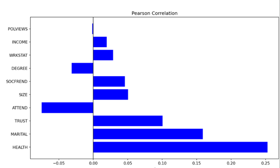
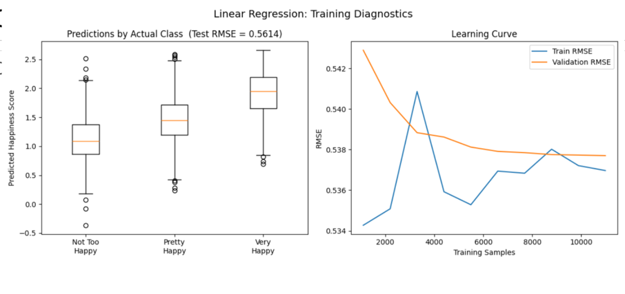

# Happiness Predictor Trained on GSS

## How to Build and Run the Code
### 1. Download the Data
The GSS dataset is too large to store in this repository (1.9GB before cleaning). So please download it using the link below! 
1. https://www.kaggle.com/datasets/norc/general-social-survey?resource=download
2. Download the CSV and move the file to: `GSS_Data_CSV_CodeBook/gss.csv`

### 2. Install Dependencies
I have followed the standard procedures, so it should be fairly easy to test the code using the command lines below.
```bash
make install
```

### 3. Run the Model
```bash
make run
```

### 4. Run Tests
```bash
make test
```
## Introduction 
Note: Detailed introduction and proposal at proposal.md

TLDR: My goal is to predict how happy and content a person feels toward their life based on their lifestyle choices, health, socioeconomic situation, gender, attachment style, job, and many other factors. In other words, I need to identify and rank the biggest predictors of happiness through a linear regression model on large survey data. 
## Methods
### Data collection and process
The source I chose to train and validate my data on is the General Social Survey (GSS) by the University of Chicago.
Shown in code
The GSS has surveyed thousands of Americans since 1972 about their happiness, marital status, income, religious practice, job satisfaction, etc.

This study has been running for 50 years, interviewing over 60,000 applicants, and covers hundreds of areas (see GSS_Codebook_index.pdf for details) that effects a persons' happinese. I downloaded this data as a csv file from Kaggle. 


I will also be asking people around me at BU similar questions to the online surveys. This will give me a set of data to validate my linear regression model with, on top of reserving 15% of my online data as my validation set.

### Data cleaning
The raw GSS CSV has 11,610 columns, of which many are empty, since the survey added more questions (and removed questions) over time.
We want clean data on factors that we actually care about. It would take way too long to train on this entire data set and to identify which features we want to focus on, so the first step was to identify which factors had the highest correlation with happinese, which participants scored from "not very happy ", "pretty happy", and "very happy."

To do this, we looped through each column and identified the strongest correlation using pearson correalation (identified by running gss_pearson_simpel.py) and got the following.

This only shows the top 10 features by magnitude, but we can already tell which features we want to focus on like marriage status, religous practice, etc.

After identifying the features we want to keep, we proceed to remove the columns unrelated to our model, thus dramatically decreasing the processing time by removing unneeded columns.

Now, there were missing columns since not every participants were asked the same questions, so we only kept the participants (rows) that answered all the questions to avoid biases. This left us with 17,164 rows of clean data.

### Feature extraction
After identifying the features that correlated strongest with happinese, we finalize our selection to include the following features: self-reported health, religious attendance, interpersonal trust, financial satisfaction, marital status, years of education, family income, life excitement, satisfaction with family life, friendships, marriage, physical health, city of residence, hobbies, spouse's education, relative income opinion, job satisfaction, and social class identification.

### Model training & Evaluation
The cleaned data set were first split into 80&20 for training and test set. We also use a random seed for robust training. 
We chose Ordinary Least Squares (OLS) linear regression model from the scikit-learn library because our target variable (happinese score) is binned from 0 to 3, thus we can associate each factor with a weight.
Both the weight and # of factors will each attribute a bit to the final happinese score, which fits for our data.
Since our goal is to understand which factors contribute strongest to happinese, we can easily be identified by looking at the corresponding weight in the linear equation.

One challenge of using GSS is the fact that the dataset is skewed toward "pretty happy" responses. Initially, I had trouble separating "pretty happy" from the other reponses. To address this issue, I used sklearn's compute_class_weight('balanced) to assign better weights by accounting for the frequency of a particular factor. In short, this helepd the model weight the 3 levels of happinese more evenly.

To evaluate the model, I chose R^2 and RMSE. I graphed the learning curve to visaulize and identify cases of underfitting and overfitting. In addition, a box plot of predicted scores vs actual scores was created.

One big limitation of my study is accurately predicting happinese score for individuals who are at the border of two score range. As one may may see in the box plot, there are some overlaps between the scores. Originally, this was much worst. I increased the weight, changed the range of the 3 happinese scores, as well as adding more features to create the result I have now.

We reversed some of the negative values so that higher value always represent higher happinese. Simarily, we also changed the happinse target range from 1-3 to 0-3, with 0.5 = Not Too Happy, 1.5 =  Pretty Happy, 2.5 = Very Happy. This was done because the model had difficulty reaching the ceiling value of 3.
## Results/Visualization

